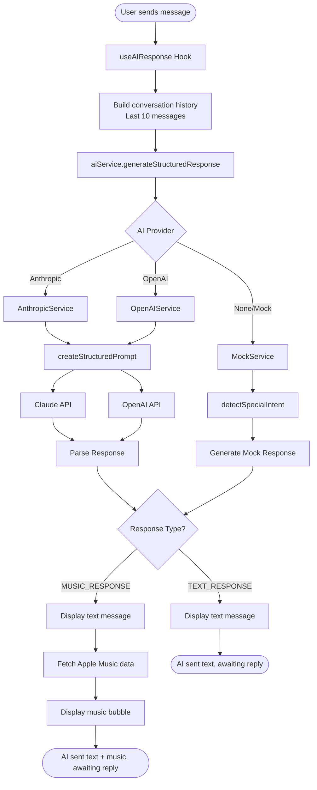

# AI Response Flow Documentation

## Overview

This document describes the AI response generation flow in the chat application, including the decision logic for determining whether to generate text-only responses or special responses (currently music with Apple Music integration, extensible for future response types).

## Architecture Diagram



## Decision Tree

### 1. Message Input Analysis

The AI service analyzes incoming messages to determine the appropriate response type:

```
User Message
    |
    ├─ Contains special intent keywords? → SPECIAL_RESPONSE
    │   ├─ Music Intent → MUSIC_RESPONSE
    │   │   ├─ "play a song"
    │   │   ├─ "recommend music"
    │   │   ├─ "what should I listen to"
    │   │   ├─ "send me a song"
    │   │   ├─ mentions specific artist/song
    │   │   └─ discusses music preferences
    │   └─ [Future: Other special intents]
    │       ├─ Location sharing
    │       ├─ Calendar events
    │       └─ File sharing
    │
    └─ No special context → TEXT_RESPONSE
        ├─ General conversation
        ├─ Questions about non-special topics
        └─ Casual chat (weather, plans, feelings)
```

### 2. Provider-Specific Logic

#### Anthropic (Claude)

```
createStructuredPrompt
    |
    ├─ Includes special intent detection
    ├─ Returns structured format:
    │   ├─ MUSIC_RESPONSE → content + musicQuery
    │   ├─ [Future: LOCATION_RESPONSE → content + location]
    │   └─ TEXT_RESPONSE → content only
    │
    └─ Handles context tracking (e.g., mentioned songs)
```

#### OpenAI (GPT)

```
createStructuredPrompt
    |
    ├─ Uses same prompt structure as Anthropic
    ├─ Parses response for special indicators
    └─ Falls back to simple special intent detection
```

#### Mock Service

```
detectSpecialIntent (keyword-based)
    |
    ├─ Scans for special intent keywords
    ├─ Returns appropriate mock response
    └─ Falls back to random text
```

## Response Processing Flow

### Text Response Flow

```
1. AI generates text response
2. Create Message object with animation values
3. Show typing indicator (fade in)
4. Crossfade animation (typing → message)
5. Display text message
6. Update inbox preview
```

### Special Response Flow - Music

```
1. AI generates special response (text + metadata)
2. Show typing indicator
3. Display text message first
4. Fetch special data - Apple Music:
   ├─ Search by query
   ├─ Get song metadata
   ├─ Prefetch album artwork
   └─ Extract dynamic colors
5. Create special message object - AppleMusicMessage
6. Display special bubble
7. Update inbox preview with special info
```

## Key Components

### Services

| Service          | File                                 | Purpose                           |
| ---------------- | ------------------------------------ | --------------------------------- |
| AIServiceManager | `services/ai/manager.ts`             | Routes to appropriate AI provider |
| AnthropicService | `services/ai/providers/anthropic.ts` | Claude API integration            |
| OpenAIService    | `services/ai/providers/openai.ts`    | OpenAI API integration            |
| MockService      | `services/ai/providers/mock.ts`      | Fallback when no API configured   |

### Core Functions

| Function                  | Purpose                                                     | Used By       |
| ------------------------- | ----------------------------------------------------------- | ------------- |
| `createStructuredPrompt`  | Detects special intents and generates appropriate responses | All providers |
| `detectSpecialIntent`     | Keyword-based detection for special response types          | Mock/fallback |
| `parseStructuredResponse` | Parses AI response into appropriate type                    | Anthropic     |
| `parseMusicResponse`      | Extracts music metadata from response                       | Anthropic     |
| `buildSpecialResponse`    | Constructs special response objects                         | Base class    |

### Response Types

```typescript
interface AIStructuredResponse {
  type: 'text' | 'music'; // Extensible for future types
  content: string; // Message text
  musicQuery?: string; // Apple Music search query (music type only)
  // Future additions:
  // location?: LocationData;
  // calendarEvent?: EventData;
  // fileInfo?: FileData;
}
```

## Special Intent Detection

### Currently Implemented: Music

The system detects music intent when messages contain:

- Direct requests: "play", "song", "music", "listen"
- Artist/song mentions: specific names
- Music questions: "favorite song", "recommend", "what should I play"
- Context words: "album", "track", "artist", "band"

### Future Special Intents

The architecture supports adding:

- **Location sharing**: "where are you", "send location", "meet at"
- **Calendar events**: "schedule", "meeting", "appointment"
- **File sharing**: "send file", "document", "photo"
- **Contact sharing**: "contact info", "phone number"

## Animation Timing

```
Text Messages:
- AI response delay: 500-800ms
- Typing indicator: 1500ms minimum
- Crossfade: 300ms
- Message slide up: 200ms

Special Messages (Music):
- Text message first (same as above)
- Pause: 1000ms
- Special bubble fetch & display
- Total: ~3-4 seconds
```

## Configuration

### Environment Variables

```bash
AI_PROVIDER=anthropic|openai  # Select provider
ANTHROPIC_API_KEY=...         # Claude API
OPENAI_API_KEY=...            # OpenAI API
APPLE_MUSIC_API_KEY=...       # Music data
```

### Provider Selection Priority

1. Check AI_PROVIDER env variable
2. Use provider if API key configured
3. Fall back to MockService

## Error Handling

```
API Failure
    |
    ├─ Log error to console
    ├─ Return fallback response
    └─ Continue conversation flow

Special Data Fetch Failure (e.g., Music)
    |
    ├─ Check preloaded data cache
    ├─ Display basic special bubble
    └─ Use text-only fallback
```

## Performance Optimizations

1. **Conversation Context**: Only last 10 messages sent to AI
2. **Data Preloading**: Special content (e.g., album art) prefetched before display
3. **Animation Overlap**: Typing indicator crossfades with message
4. **Parallel Processing**: Special data (e.g., music) fetched while showing text
5. **Extensible parsing**: `parseStructuredResponse` method ready for new response types

## Adding New Special Response Types

To add a new special response type:

1. **Update constants** (`services/ai/constants.ts`):
   - Add new response type to `RESPONSE_TYPES`
   - Add detection keywords if needed

2. **Update prompt** (`services/ai/prompts.ts`):
   - Add detection rules to `createStructuredPrompt`
   - Include examples for the new type

3. **Update parser** (`services/ai/providers/anthropic.ts`):
   - Add new parsing method (e.g., `parseLocationResponse`)
   - Update `parseStructuredResponse` to handle new type

4. **Update UI** (`hooks/useAIResponse.ts`):
   - Add handling for new response type
   - Create appropriate message bubble component

## Testing Considerations

- Mock service always available (no API key required)
- Special intent detection testable via keywords
- Animation timings configurable via constants
- Response types verifiable in console logs
- Extensible architecture allows easy addition of new response types
