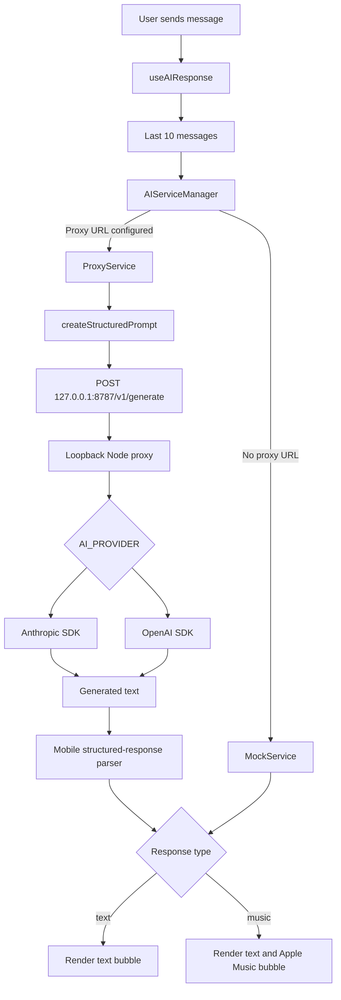

# AI Response Flow

## Overview

The prototype separates mobile presentation logic from provider credentials:

- the Expo app builds conversation context, owns the structured prompt, parses
  generated text, and renders messages;
- a loopback-only Node service owns provider selection and credentials; and
- Anthropic and OpenAI SDKs run only inside the Node service.

This boundary supports live AI in the iOS Simulator without embedding provider
keys in the client application.

## Architecture


```mermaid
flowchart TD
    User[User sends message] --> Hook[useAIResponse]
    Hook --> History[Last 10 messages]
    History --> Manager[AIServiceManager]
    Manager -->|Proxy URL configured| MobileProxy[ProxyService]
    Manager -->|No proxy URL| Mock[MockService]
    MobileProxy --> Prompt[createStructuredPrompt]
    Prompt --> LocalHTTP[POST 127.0.0.1:8787/v1/generate]
    LocalHTTP --> Server[Loopback Node proxy]
    Server --> Provider{AI_PROVIDER}
    Provider --> Anthropic[Anthropic SDK]
    Provider --> OpenAI[OpenAI SDK]
    Anthropic --> RawText[Generated text]
    OpenAI --> RawText
    RawText --> Parser[Mobile structured-response parser]
    Parser --> Response{Response type}
    Mock --> Response
    Response -->|text| Text[Render text bubble]
    Response -->|music| Music[Render text and Apple Music bubble]
```

## Trust Boundary

The app reads only this non-secret value:

```dotenv
EXPO_PUBLIC_AI_PROXY_URL=http://127.0.0.1:8787
```

The local Node process reads:

```dotenv
AI_PROVIDER=anthropic
ANTHROPIC_API_KEY=...
OPENAI_API_KEY=...
AI_PROXY_PORT=8787
```

Provider credentials never cross the HTTP boundary. The proxy binds to
`127.0.0.1` and does not accept a host override.

## Request Flow

1. `useAIResponse` takes the last ten messages and adds the new user message.
2. `AIServiceManager` selects `ProxyService` when the proxy URL is configured;
   otherwise it selects `MockService`.
3. `ProxyService` combines the contact name, mentioned-song history, and bubble
   formats through `createStructuredPrompt`.
4. The app sends `POST /v1/generate`:

   ```json
   {
     "systemPrompt": "You are Ruth, having a casual text conversation...",
     "messages": [
       {
         "role": "user",
         "content": "Recommend a song"
       }
     ]
   }
   ```

5. The Node proxy validates the media type, 64 KiB size limit, system prompt,
   message roles, and message content.
6. The proxy calls the server-selected provider and returns raw text:

   ```json
   {
     "content": "TEXT_RESPONSE\nYou should try this one!"
   }
   ```

7. `BaseAIProvider` parses that text into `AIStructuredResponse`.
8. `useAIResponse` renders the existing typing and message animations.

## Server Components

| Component         | File                            | Responsibility                                    |
| ----------------- | ------------------------------- | ------------------------------------------------- |
| Configuration     | `server/ai-proxy/config.mjs`    | Validate provider, matching key, and port         |
| Provider adapters | `server/ai-proxy/providers.mjs` | Translate neutral requests into SDK calls         |
| HTTP handler      | `server/ai-proxy/handler.mjs`   | Route, validate, limit, and sanitize HTTP traffic |
| Entrypoint        | `server/ai-proxy/index.mjs`     | Load `.env` and listen on IPv4 loopback           |

## Mobile Components

| Component     | File                             | Responsibility                                      |
| ------------- | -------------------------------- | --------------------------------------------------- |
| AI manager    | `services/ai/manager.ts`         | Select proxy or mock and provide fallback responses |
| Proxy service | `services/ai/providers/proxy.ts` | Build prompts, call loopback, and parse text        |
| Base provider | `services/ai/providers/base.ts`  | Parse text/music formats and track songs            |
| Mock service  | `services/ai/providers/mock.ts`  | Provide offline prototype responses                 |
| Response hook | `hooks/useAIResponse.ts`         | Build context and render the response flow          |

The mobile source tree does not import either provider SDK.

## Response Types

```typescript
interface AIStructuredResponse {
  type: 'text' | 'music';
  content: string;
  musicQuery?: string;
}
```

### Text Response

1. The parser removes `TEXT_RESPONSE` artifacts.
2. The typing indicator crossfades into a text message.
3. The inbox preview updates with the response.

### Music Response

1. The parser recognizes `MUSIC_RESPONSE` and extracts `MUSIC_QUERY`.
2. The text reaction appears first.
3. The app searches Apple Music, preloads artwork, and creates the music bubble.
4. The song query is tracked to discourage duplicate suggestions.

## Error Handling

```text
Invalid client request
    -> Proxy returns 400 or 413
    -> Mobile provider throws
    -> Manager returns preset fallback

Provider SDK failure
    -> Proxy logs provider identity only
    -> Proxy returns sanitized 502
    -> Mobile provider throws
    -> Manager returns preset fallback

Proxy offline, invalid JSON, or 30-second timeout
    -> Mobile provider throws
    -> Manager returns preset fallback
```

The server never returns provider errors, stack traces, request headers, or
credentials. Apple Music lookup failures continue to use the existing preloaded
data or basic music-bubble fallback.

## Provider Selection

Set `AI_PROVIDER=anthropic` or `AI_PROVIDER=openai` in `.env` and restart
`npm run ai-proxy`. The app does not select providers. The matching private key
must be present when the proxy starts.

Current server defaults are:

| Provider  | Model               | Maximum tokens | Temperature |
| --------- | ------------------- | -------------: | ----------: |
| Anthropic | `claude-sonnet-4-6` |            150 |         0.8 |
| OpenAI    | `gpt-4o`            |            150 |         0.8 |

OpenAI also retains presence penalty `0.6` and frequency penalty `0.5`.

## Testing

- Node tests inject fake SDK clients and exercise configuration and HTTP
  behavior without paid calls.
- Jest injects `fetch` into `ProxyService` and verifies parsing, errors, and
  timeout behavior.
- A static regression test rejects provider keys or SDK imports in production
  mobile source.
- `GET /health` verifies loopback startup without calling a provider.

See [AI Integration Setup](./AI_SETUP.md) for commands.
